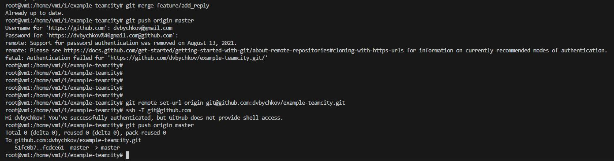

«Teamcity» - «Бычков Денис Вячеславович»      
    
--- 

Создайте два пустых публичных репозитория в любом своём проекте: vector-role и lighthouse-role.

example-teamcity - https://github.com/dvbychkov/example-teamcity

Основная часть

